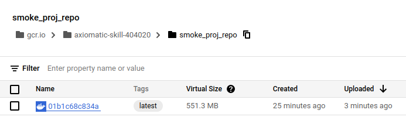
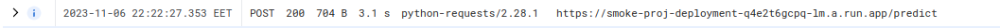

# **Binary Prediction of Smoker Status using Bio-Signals**  
  
## **Problem Description**   
   
The problem is to build a model that can accurately classify patients into two categories: smokers and non-smokers. To achieve this, we're utilizing fine-tuned gradient boosting decision trees from LGBM (also, logistic regression and random forest have been considered). Trained model has been implemented as a web service and deployed on the Google Cloud Platform.

Smoking detection is a critical public health issue that involves the identification and quantification of exposure to tobacco smoke. The problem is significant because it has a direct impact on the health and well-being of individuals and populations. For example, the paper ["Biomarkers increase detection of active smoking and secondhand smoke exposure in critically ill patients"](https://www.ncbi.nlm.nih.gov/pmc/articles/PMC3148017/) underscores the utility of biomarkers in improving the accuracy and reliability of smoking detection.
   
## **Dataset description** 
   
The data for this project is sourced from the active [Kaggle competition](https://www.kaggle.com/competitions/playground-series-s3e24/overview) during the project work. It's important to note that data is synthetical.

- train.csv - the training dataset; smoking is the binary target
- test.csv - the test dataset; your objective is to predict the probability of positive smoking
- sample_submission.csv - a sample submission file in the correct format

Training dataset contains 159k patient records with biomarkers and smoking status.

Testing dataset contains 106k similar records without smoking status.

22 columns with biomarkers are listed in notebook.ipynb.

## **Structure**    
   
The project contains the next files and folders:

* `data/train.csv` - labeled dataset    
* `data/test.csv` - unlabeled dataset for testing on Kaggle
* `data/sample_submission.csv` - unlabeled dataset for submition on Kaggle
* `notebook.ipynb` - notebook with EDA and ML model training    
* `model.pkl` - saved final GBDT model    
* `Pipfile` and `Pipfile.lock` - configuration files that specify the project's dependencies 
* `train.py` - script for model training 
* `preprocessing.py` - feature engineering
* `predict.py` - script for deploying a web service (Flask) using the final model    
* `Dockerfile` - encapsulating the Flask application within a container.
* `request_cloud.py` - script for generating predictions using the deployed application on GCP
* `request_local.py` - script for generating predictions using the deployed application (whether encapsulated in a container or not)   
* `images` - folder with images  
* `README.md` - project documentation

## **Environment**   
   
The project's virtual environment is established with Pipenv. To install Pipenv use the command:
   
`pip install pipenv`   
   
To install all the specified dependencies:  
   
`pipenv install`  

To activate virtual environment:

`pipenv shell`   
 

## **Local server deployment**   
      
The final model has been implemented in a web service, and to run it, the following steps are required:

- Install Docker. Docker can be obtained from the official website at https://www.docker.com/.

- Access the Dockerfile. In the current repository or a cloned repository on your local machine, you will find a Dockerfile containing all the specifications required to build the container. This includes Python, the virtual environment, scripts, the model file, and other dependencies.

- To construct the container, initiate Docker on your system, launch a terminal or command window and input the following command:
   
`docker build -t proj_smoking .`   
   
To run the image: 
   
`docker run -d -p 8080:8080 --name smoke_container_new  test_proj_1 proj_smoking`   
   
Run a script `request_local.py`:    
    
`pipenv run request_local.py`   

   
## **GCP deployment**   
   
To push the image on GCP repository, you need to input the following commands (after completing all the necessary steps for registration and SDK installation): 
      
`docker tag proj_smoking gcr.io/axiomatic-skill-404020/smoke_proj_repo`  (axiomatic-skill-404020 is GCP project id)
   
`docker push gcr.io/axiomatic-skill-404020/smoke_proj_repo`

 
      

     
 
   

 Now you can find the image in the GCP repository. Then use Cloud Run to deploy the image.

 
      

     
 

Deployed service:

 
      

     
    

To invoke a running service, you'll need to put a valid URL in your request_cloud.py script. To test the deployed application, run the following command:

`pipenv run request_cloud.py`

 
      

     
   